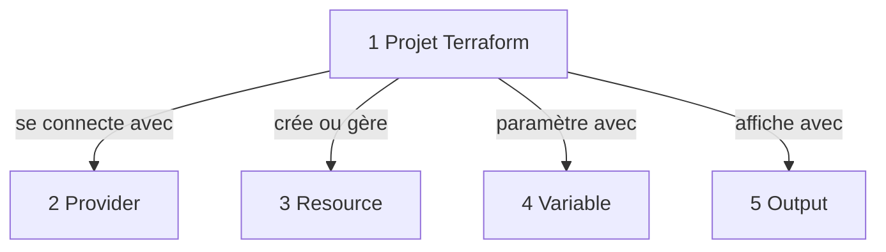
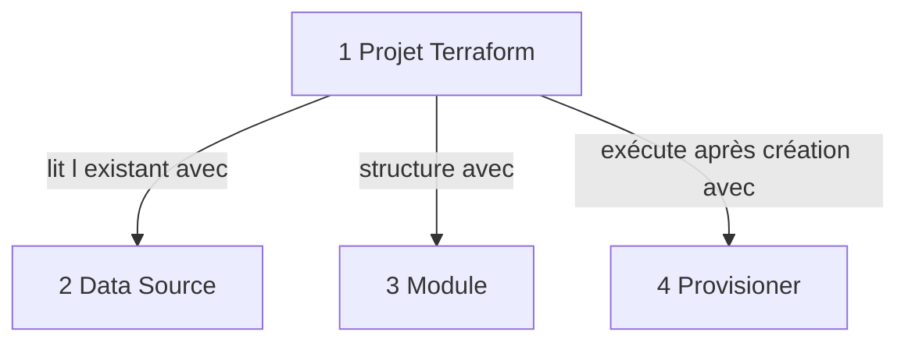
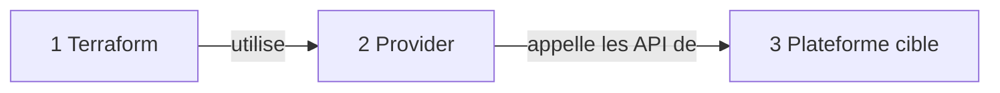
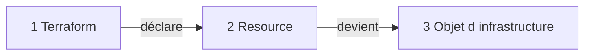
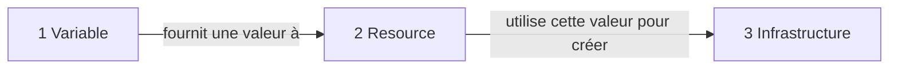
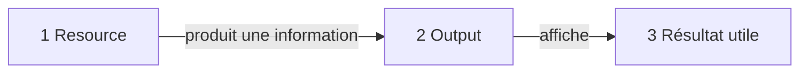
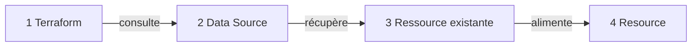
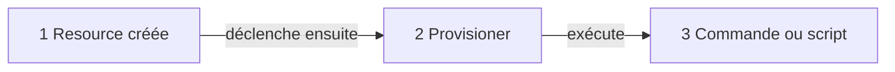
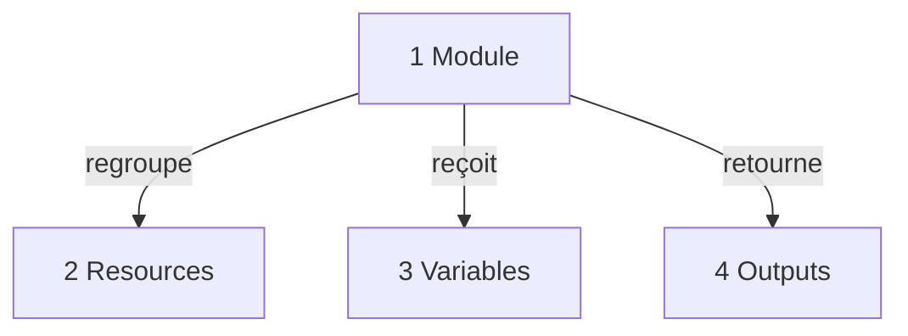
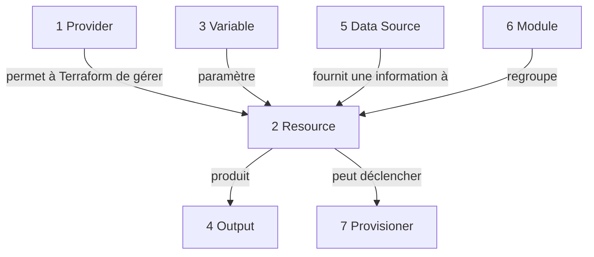

# 2. Les composants Terraform

## Objectif

Comprendre les éléments qui composent un projet Terraform et savoir les placer dans une progression logique.

Terraform ne se limite pas à créer des ressources. Il utilise plusieurs composants pour :

**se connecter**, **décrire**, **paramétrer**, **lire**, **organiser**, **contrôler**, **valider** et **mémoriser** l’infrastructure.

---

# 2.1 Vue d’ensemble très simplifiée

## À retenir

**Provider** : connexion à une plateforme  
**Resource** : élément d’infrastructure à créer  
**Variable** : valeur configurable  
**Output** : résultat affiché après exécution

---

# 2.2 Vue d’ensemble suite

## À retenir

**Data Source** : lire une ressource existante  
**Module** : organiser et réutiliser le code  
**Provisioner** : action après création, à utiliser rarement

---

# 2.3 Provider

## Explication courte

Le **Provider** est le connecteur entre Terraform et une plateforme.

Exemples :

**Azure**, **AWS**, **Kubernetes**, **GitLab**, **Docker**.

## Idée clé

**Terraform ne parle pas directement au cloud. Il passe par un provider.**

---

# 2.4 Resource

## Explication courte

Une **Resource** représente un élément que Terraform doit créer, modifier ou supprimer.

Exemples :

**VM**, **réseau**, **subnet**, **adresse IP**, **base de données**, **bucket**, **cluster**.

## Idée clé

**La resource est le cœur du code Terraform.**

---

# 2.5 Variable

## Explication courte

Une **Variable** rend le code configurable.

Exemples :

**région**, **taille VM**, **nom projet**, **environnement**.

## Idée clé

**Variable = valeur fournie depuis l’extérieur.**

---

# 2.6 Output

## Explication courte

Un **Output** affiche une information après l’exécution.

Exemples :

**IP publique**, **URL**, **nom de ressource**, **identifiant**.

## Idée clé

**Output = résultat visible après apply.**

---

# 2.7 Data Source

## Explication courte

Une **Data Source** lit une information existante sans créer une nouvelle ressource.

Exemples :

**image Ubuntu existante**, **réseau existant**, **groupe de ressources existant**, **clé SSH existante**.

## Idée clé

**Resource = créer ou gérer.**  
**Data Source = lire sans créer.**

---

# 2.8 Provisioner

## Explication courte

Un **Provisioner** exécute une action après la création d’une ressource.

Exemples :

**copier un fichier**, **lancer un script**, **installer un paquet**.

## Idée clé

**Provisioner = action post-création.**

À utiliser avec prudence.  
Pour la configuration système avancée, **Ansible** est souvent plus adapté.

---

# 2.9 Module

## Explication courte

Un **Module** est une brique Terraform réutilisable.

Il peut regrouper plusieurs ressources.

Exemple :

un module **VM** peut contenir :

**réseau**, **subnet**, **IP publique**, **interface réseau**, **machine virtuelle**.

## Idée clé

**Module = organisation et réutilisation du code.**

---

# 2.10 Synthèse des composants fondamentaux

## Lecture rapide

**Provider** connecte Terraform à la plateforme.  
**Resource** représente l’infrastructure.  
**Variable** personnalise les valeurs.  
**Output** affiche les résultats.  
**Data Source** lit l’existant.  
**Module** structure le code.  
**Provisioner** exécute une action après création.
