# 

# 3. Les mécanismes avancés de Terraform

Les composants précédents sont les bases.

Les éléments suivants sont mieux appelés **mécanismes avancés de Terraform** Ils servent à :

- **configurer Terraform**, 

- **gérer l’état**, 

- **factoriser**,

- **contrôler le comportement**, 

- **valider**, 

- **migrer** 
  
  

---

# 3.1 Vue d’ensemble des mécanismes avancés

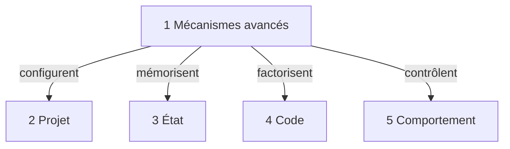

## À retenir

**Projet** : configuration générale  
**État** : mémoire de Terraform  
**Code** : réduction des répétitions  
**Comportement** : contrôle de la création et modification

---

# 3.2 Vue d’ensemble suite

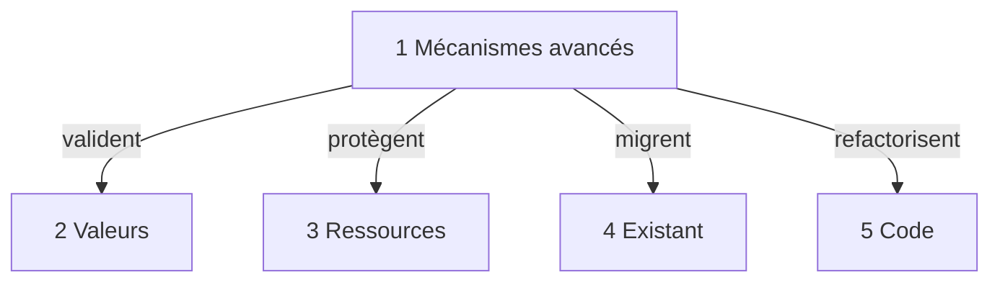

## À retenir

**Validation** : éviter les mauvaises valeurs  
**Protection** : éviter les destructions dangereuses  
**Migration** : intégrer une ressource existante  
**Refactoring** : renommer sans détruire

---

# 3.3 terraform block

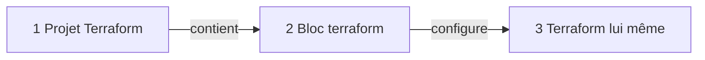

## Explication courte

Le **terraform block** configure Terraform.

Il peut déclarer :

**version minimale**, **providers requis**, **backend**.

## Idée clé

**terraform block = configuration générale de Terraform.**

---

# 3.4 required_providers

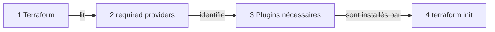

## Explication courte

**required_providers** indique quels providers le projet doit installer.

Il précise généralement :

**nom**, **source**, **version**.

## Idée clé

**required_providers = quel plugin installer.**

---

# 3.5 provider

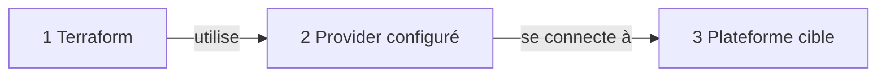

## Explication courte

Le bloc **provider** configure l’utilisation réelle du provider.

Il peut contenir :

**région**, **subscription**, **tenant**, **credentials**, **options de connexion**.

## Idée clé

**provider = comment se connecter à la plateforme.**

---

# 3.6 Différence required_providers et provider

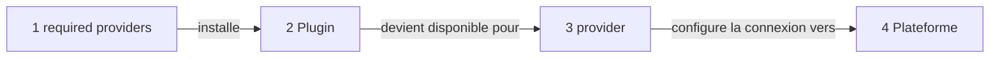

## Différence claire

**required_providers** : déclare le plugin à installer.

**provider** : configure la connexion à utiliser.

## Exemple mental

**required_providers** : j’ai besoin du plugin AzureRM.  
**provider** : je me connecte à Azure avec cette configuration.

---

# 3.7 backend

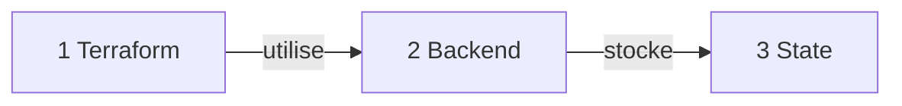

## Explication courte

Le **backend** indique où Terraform stocke le **state**.

Exemples :

**local**, **Azure Storage**, **AWS S3**, **Terraform Cloud**, **GitLab managed state**.

## Idée clé

**backend = emplacement du state.**

---

# 3.8 state

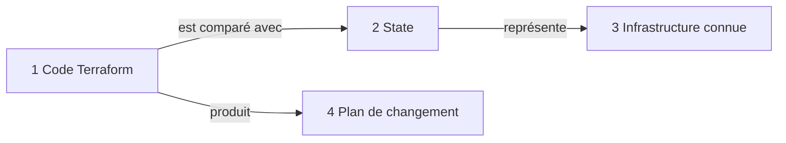

## Explication courte

Le **state** est la mémoire de Terraform.

Il indique ce que Terraform connaît déjà :

**ressources créées**, **identifiants**, **relations**, **valeurs calculées**.

## Idée clé

**state = mémoire de Terraform.**

---

# 3.9 remote state

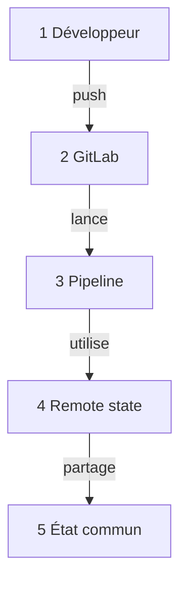

## Explication courte

Le **remote state** permet de partager le state entre plusieurs personnes ou pipelines.

Très important avec :

**GitLab CI/CD**, **Azure**, **travail en équipe**.

## Idée clé

**remote state = state partagé.**

---

# 3.10 state locking

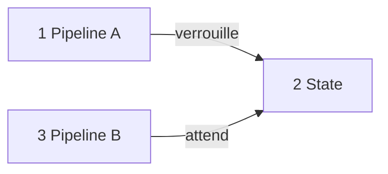

## Explication courte

Le **state locking** évite que deux exécutions Terraform modifient le même state en même temps.

## Idée clé

**state locking = protection contre les modifications concurrentes.**

---

# 3.11 locals

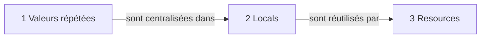

## Explication courte

Les **locals** servent à définir des valeurs internes réutilisables.

Différence importante :

**Variable** : valeur fournie depuis l’extérieur.  
**Local** : valeur définie ou calculée dans le code.

## Idée clé

**locals = valeurs internes pour éviter la répétition.**

---

# 3.12 count

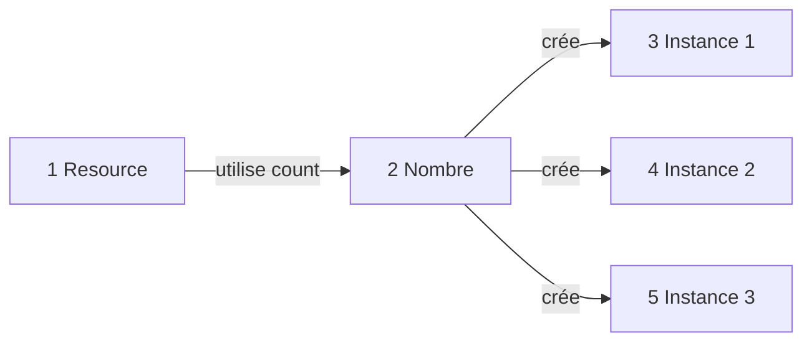

## Explication courte

**count** permet de créer plusieurs instances d’une même ressource.

Exemple :

**créer 3 VM identiques**.

## Idée clé

**count = répéter par nombre.**

---

# 3.13 for_each

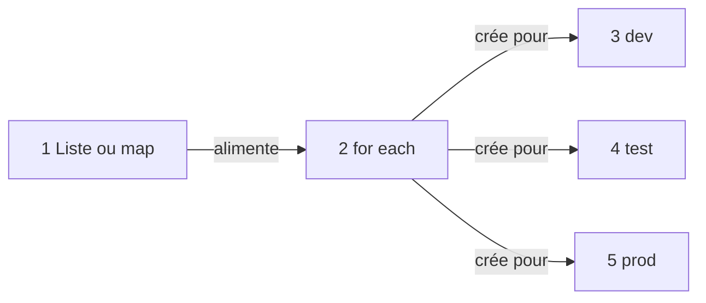

## Explication courte

**for_each** crée plusieurs ressources à partir d’une liste ou d’une map.

Exemple :

**un subnet dev**, **un subnet test**, **un subnet prod**.

## Idée clé

**for_each = répéter par élément nommé.**

---

# 3.14 Différence count et for_each

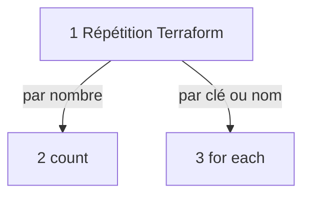

## Différence claire

**count** : utile pour créer plusieurs objets similaires.

**for_each** : meilleur quand chaque objet a une identité claire.

## Exemple mental

**count** : créer 3 VM.  
**for_each** : créer une VM pour dev, test et prod.

---

# 3.15 depends_on

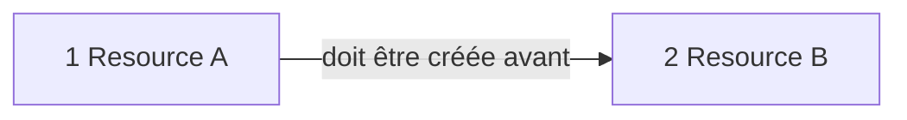

## Explication courte

**depends_on** force un ordre de dépendance.

Terraform détecte beaucoup de dépendances automatiquement, mais parfois il faut l’aider.

## Idée clé

**depends_on = forcer l’ordre.**

---

# 3.16 lifecycle

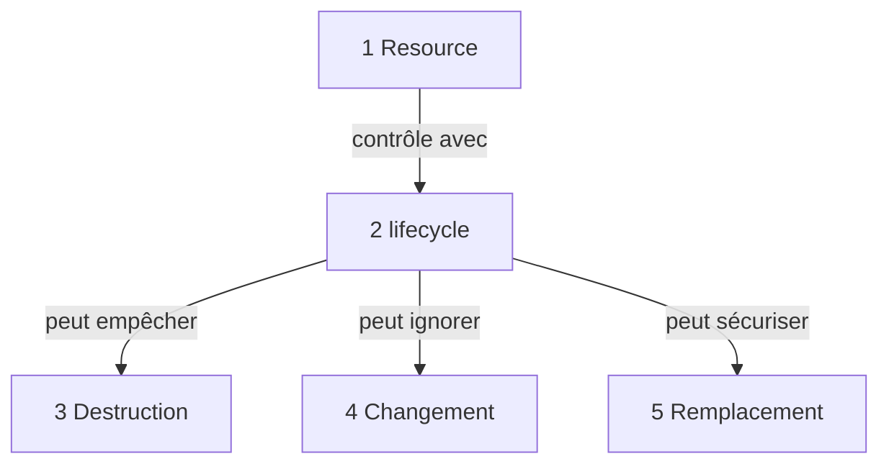

## Explication courte

**lifecycle** contrôle le comportement d’une ressource.

Il peut servir à :

**empêcher la destruction**, **ignorer certains changements**, **créer avant de détruire**.

## Idée clé

**lifecycle = règles de protection.**

---

# 3.17 provider alias

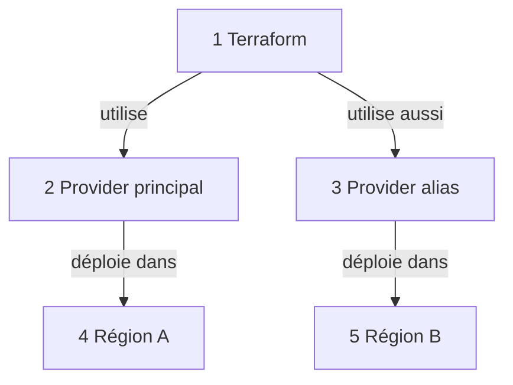

## Explication courte

Un **provider alias** permet d’utiliser plusieurs configurations du même provider.

Exemple :

**Azure France Central** et **Azure West Europe**.

## Idée clé

**provider alias = plusieurs configurations du même provider.**

---

# 3.18 validation

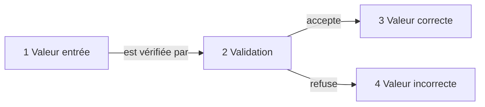

## Explication courte

La **validation** vérifie les valeurs fournies aux variables.

Exemples :

**environnement autorisé**, **région autorisée**, **taille VM autorisée**.

## Idée clé

**validation = bloquer les mauvaises valeurs.**

---

# 3.19 precondition

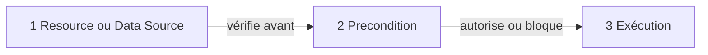

## Explication courte

Une **precondition** vérifie une règle avant l’utilisation d’une ressource, d’une data source ou d’un output.

## Idée clé

**precondition = contrôle avant.**

---

# 3.20 postcondition

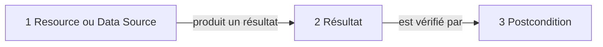

## Explication courte

Une **postcondition** vérifie une règle après l’évaluation d’une ressource ou d’une data source.

## Idée clé

**postcondition = contrôle après.**

---

# 3.21 check block

```mermaid
flowchart LR
    A[1 Infrastructure] -->|est testée par| B[2 Check block]
    B -->|signale| C[3 Problème éventuel]
```

## Explication courte

Un **check block** ajoute un contrôle global.

Exemples :

**tester une URL**, **vérifier un endpoint**, **contrôler un service**.

## Idée clé

**check block = contrôle global.**

---

# 3.22 import block

```mermaid
flowchart LR
    A[1 Ressource existante] -->|est rattachée à| B[2 Terraform]
    B -->|l’ajoute dans| C[3 State]
```

## Explication courte

Un **import block** permet de rattacher une ressource déjà existante à Terraform.

Exemple :

une VM existe déjà dans Azure et on veut maintenant la gérer avec Terraform.

## Idée clé

**import block = intégrer l’existant.**

---

# 3.23 moved block

```mermaid
flowchart LR
    A[1 Ancienne adresse] -->|devient| B[2 Nouvelle adresse]
    B -->|évite| C[3 Destruction inutile]
```

## Explication courte

Un **moved block** permet de renommer ou déplacer une ressource dans le code sans provoquer sa destruction.

## Idée clé

**moved block = refactoriser sans détruire.**

---

# 4. Synthèse générale

## Schéma 4.1 — Composants fondamentaux

```mermaid
flowchart TD
    A[1 Provider] -->|connecte| B[2 Terraform]
    B -->|crée| C[3 Resource]
    D[4 Variable] -->|paramètre| C
    E[5 Data Source] -->|alimente| C
    C -->|produit| F[6 Output]
    G[7 Module] -->|regroupe| C
```

## À retenir

Les composants fondamentaux expliquent **comment Terraform décrit et construit l’infrastructure**.

---

## Schéma 4.2 — Mécanismes avancés

```mermaid
flowchart TD
    A[1 Terraform avancé] -->|configure avec| B[2 terraform block]
    A -->|installe avec| C[3 required providers]
    A -->|stocke avec| D[4 backend]
    A -->|mémorise avec| E[5 state]
```

## À retenir

Ces mécanismes expliquent **comment Terraform fonctionne en interne**.

---

## Schéma 4.3 — Contrôle du comportement

```mermaid
flowchart TD
    A[1 Resource] -->|répète avec| B[2 count]
    A -->|répète par nom avec| C[3 for each]
    A -->|ordonne avec| D[4 depends on]
    A -->|protège avec| E[5 lifecycle]
```

## À retenir

Ces mécanismes expliquent **comment Terraform contrôle la création des ressources**.

---

## Schéma 4.4 — Qualité, migration et refactoring

```mermaid
flowchart TD
    A[1 Projet Terraform] -->|sécurise avec| B[2 validation]
    A -->|contrôle avec| C[3 precondition]
    A -->|vérifie avec| D[4 postcondition]
    A -->|importe avec| E[5 import block]
    A -->|renomme avec| F[6 moved block]
```

## À retenir

Ces mécanismes expliquent **comment rendre un projet Terraform fiable et maintenable**.

--
