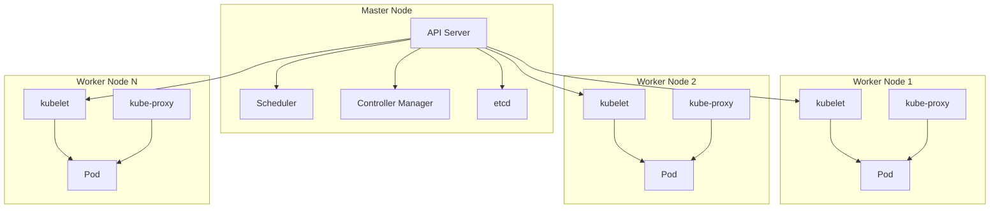

#Architecture Kubernetes



Voici une fusion complète et détaillée des deux fichiers pour créer un tutoriel complet Kubernetes. Tous les contenus sont inclus sans omission et organisés de manière cohérente.

---

# **Tutoriel Kubernetes : Vue d'ensemble et Commandes Complètes**

---

## **1. Vue d'ensemble de Kubernetes**

### **1.1. Architecture**
- **Control Plane** : 
  - **API Server** : Expose l'API Kubernetes.
  - **Scheduler** : Planifie les Pods sur les nœuds.
  - **Controller Manager** : Gère les contrôleurs Kubernetes.
  - **etcd** : Stockage clé-valeur distribué pour les configurations.
- **Nodes (Nœuds)** :
  - **Kubelet** : S'assure que les conteneurs sont en cours d'exécution.
  - **Kube Proxy** : Communication réseau entre les Pods.
  - **Pods** : Groupe de conteneurs déployés sur un nœud.

### **1.2. Installation de Kubernetes**
- **Docker Desktop** :
  - Activer Kubernetes dans les paramètres de Docker Desktop.
  - Vérifier l'installation avec :
    ```bash
    kubectl version --client
    ```

---

## **2. Commandes Générales Kubernetes**

### **2.1. Informations Générales**
- Aide générale :
  ```bash
  kubectl -h
  ```
- Version de Kubernetes :
  ```bash
  kubectl version
  ```
- Lister les API disponibles :
  ```bash
  kubectl api-versions
  kubectl api-resources
  ```

### **2.2. Configuration**
- Afficher la configuration actuelle :
  ```bash
  kubectl config view -o yaml
  ```
- Lister les contextes disponibles :
  ```bash
  kubectl config get-contexts
  ```
- Changer de contexte :
  ```bash
  kubectl config use-context <nom-contexte>
  ```
- Afficher le contexte actuel :
  ```bash
  kubectl config current-context
  ```

---

## **3. Gestion des Objets Kubernetes**

### **3.1. Namespaces**
- Créer un namespace avec YAML :
  ```yaml
  apiVersion: v1
  kind: Namespace
  metadata:
    name: dev
  ```
  ```bash
  kubectl apply -f namespace-dev.yaml
  ```
- Vérifier les namespaces :
  ```bash
  kubectl get namespaces
  ```

### **3.2. Pods**
- Créer un Pod avec une image Docker :
  ```bash
  kubectl run mypod --image=nginx
  ```
- Voir les Pods en cours d'exécution :
  ```bash
  kubectl get pods --field-selector=status.phase=Running
  ```
- Supprimer un Pod :
  ```bash
  kubectl delete pod <nom_pod>
  ```
- Accéder à un Pod :
  ```bash
  kubectl exec -ti <nom_pod> -- /bin/bash
  ```
- Annoter un Pod :
  ```bash
  kubectl annotate pod <nom_pod> key1=value1 key2=value2
  ```
- Ajouter des labels pour les Pods :
  ```bash
  kubectl label pod <nom_pod> environment=dev
  ```

---

### **3.3. Deployments**
- Créer un déploiement :
  ```bash
  kubectl create deployment nginx-deployment --image=nginx
  ```
- Mettre à jour une image :
  ```bash
  kubectl set image deployment/nginx-deployment nginx-container=nginx:1.19
  ```
- Supprimer un déploiement :
  ```bash
  kubectl delete deployment <nom_deployment>
  ```
- Auto-scaling d'un déploiement :
  ```yaml
  apiVersion: autoscaling/v2beta2
  kind: HorizontalPodAutoscaler
  metadata:
    name: myapp-hpa
  spec:
    scaleTargetRef:
      apiVersion: apps/v1
      kind: Deployment
      name: nginx-deployment
    minReplicas: 2
    maxReplicas: 5
    metrics:
    - type: Resource
      resource:
        name: cpu
        target:
          type: Utilization
          averageUtilization: 80
  ```

---

### **3.4. Services**
- Créer un service NodePort :
  ```bash
  kubectl expose deployment nginx-deployment --type=NodePort --port=5000 --target-port=80
  ```
- Exposer un service avec YAML :
  ```yaml
  apiVersion: v1
  kind: Service
  metadata:
    name: myapp-service
  spec:
    type: ClusterIP
    selector:
      app: nginx
    ports:
      - port: 5000
        targetPort: 80
  ```
  ```bash
  kubectl apply -f service.yaml
  ```

---

### **3.5. ConfigMaps**
- Créer un ConfigMap avec des clés/valeurs :
  ```bash
  kubectl create configmap app-config --from-literal=key1=value1
  ```
- Monter un ConfigMap dans un Pod :
  ```yaml
  envFrom:
    - configMapRef:
        name: app-config
  ```

---

### **3.6. Secrets**
- Créer un Secret :
  ```bash
  kubectl create secret generic mysql-secret --from-literal=rootpassword=my-password
  ```
- Référencer un Secret dans un Pod :
  ```yaml
  env:
    - name: MYSQL_ROOT_PASSWORD
      valueFrom:
        secretKeyRef:
          name: mysql-secret
          key: rootpassword
  ```

---

## **4. Gestion Avancée**

### **4.1. Logs et Événements**
- Afficher les logs d’un Pod :
  ```bash
  kubectl logs <nom_pod>
  ```
- Afficher les événements :
  ```bash
  kubectl get events
  ```
- Filtrer les événements par type :
  ```bash
  kubectl get events --field-selector type=Warning
  ```

---

### **4.2. Ingress**
- Exemple d’Ingress pour plusieurs routes :
  ```yaml
  apiVersion: networking.k8s.io/v1
  kind: Ingress
  metadata:
    name: multiapp-ingress
  spec:
    rules:
    - host: myapp.io
      http:
        paths:
        - path: /
          pathType: Prefix
          backend:
            service:
              name: app1
              port:
                number: 80
        - path: /app2
          pathType: Prefix
          backend:
            service:
              name: app2
              port:
                number: 80
  ```

---

Ce guide inclus l’intégralité des informations et commandes des deux fichiers et les organise pour créer un tutoriel clair et détaillé pour apprendre Kubernetes.

