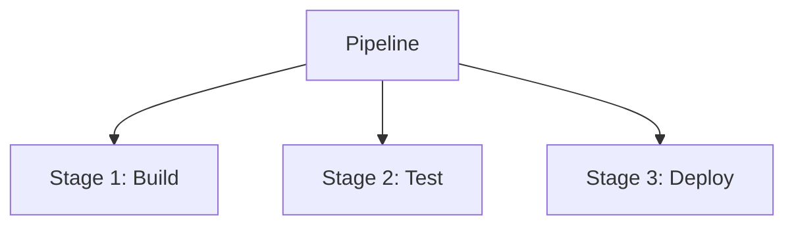
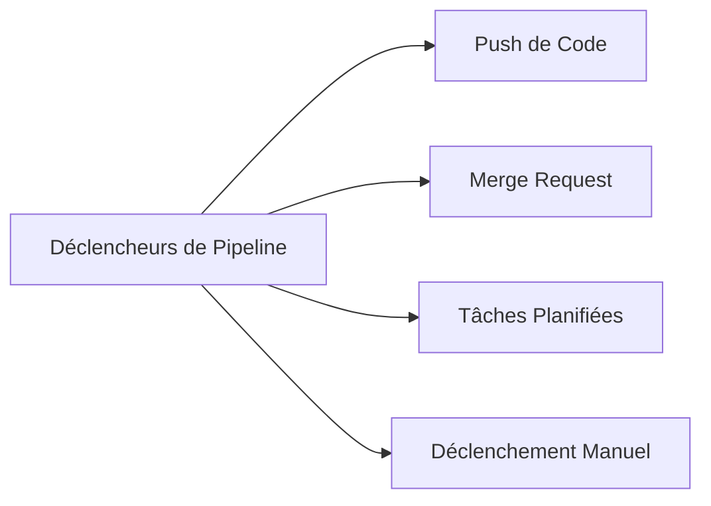
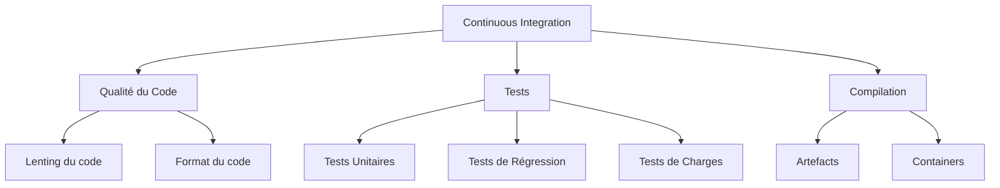
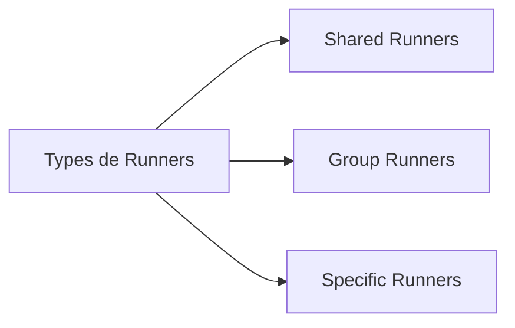
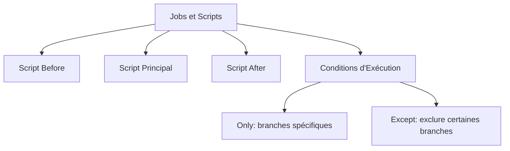

# Introduction Gitlab CI


## 1. Structure d'un Pipeline GitLab CI : Vue d'Ensemble

### 1.1 Composants Essentiels d'un Pipeline GitLab CI
1. **Stages** : Représentent des étapes logiques dans le pipeline, comme *build*, *test*, et *deploy*. Les stages s’exécutent de manière séquentielle.
2. **Jobs** : Tâches spécifiques exécutées au sein de chaque stage. Chaque job peut contenir un **script** avec des commandes Shell à exécuter dans un environnement défini.

### 1.2 Éléments Optionnels dans un Pipeline GitLab CI
Pour personnaliser et contrôler davantage le comportement des pipelines, plusieurs éléments optionnels peuvent être ajoutés :

1. **Déclencheurs (Triggers)** :
   - **Déclencheurs Manuels** : Permettent de lancer des jobs spécifiques de manière manuelle. [Manual cliquez ici](manual.md)
   - **Push de Code** : Exécute automatiquement le pipeline à chaque commit. [Push du code cliquez ici](pushcode.yaml)
   - **Merge Requests** : Valide l’intégration de code lors de chaque pull request.[Merge request cliquez ici](mergerequest.yml)
   - **Tâches Planifiées (Cron)** : Exécute des pipelines à des horaires définis. [CRON cliquez ici](scheduler.md)
   - **Triggers Personnalisés** : Déclenchés par des webhooks ou via l'API GitLab. [Personalisé cliquez ici](webhook.md)
   
2. **Variables d’Environnement** :
   - Stockent des informations dynamiques ou sensibles, comme des clés API, que les jobs peuvent utiliser.

3. **Artifacts** :
   - Fichiers générés par un job, stockés et partagés avec d’autres stages pour permettre des tâches comme l’archivage de logs ou le transfert de binaires.

4. **Cache** :
   - Partage des fichiers temporaires (dépendances, compilations, etc.) entre jobs pour optimiser l’exécution du pipeline.

5. **Conditions d’Exécution** :
   - **only** et **except** : Spécifient sur quelles branches ou événements le job doit s'exécuter.
   - **rules** : Définissent des règles d'exécution avancées.
   - **when** : Indique quand un job doit s'exécuter (ex: `on_success`, `on_failure`).

6. **Services** :
   - Fournissent des conteneurs auxiliaires pour l'exécution des jobs (ex: bases de données, serveurs temporaires).

7. **Runners et Tags** :
   - **Runners** : Machines configurées pour exécuter les jobs.
   - **Tags** : Associés aux jobs pour spécifier quels Runners doivent les exécuter.

8. **Dependencies** :
   - Permettent de définir l’ordre d'exécution des jobs, en établissant des dépendances entre eux.

9. **Timeouts** :
   - Limite la durée d’exécution des jobs, pour éviter une consommation excessive des ressources.

10. **Before Script et After Script** :
    - **before_script** : Commandes exécutées avant chaque job.
    - **after_script** : Commandes exécutées après chaque job, souvent pour le nettoyage.


### 1.3 Vue Simplifiée du Pipeline


---


## 2. Déclencheurs de Pipeline dans GitLab CI
Les pipelines GitLab peuvent être déclenchés via différents événements :

- **Push de Code** : Automatiquement lors de chaque modification.
- **Merge Request** : Pour valider l’intégration de code.
- **Tâches Planifiées (Cron)** : Pour des exécutions régulières.
- **Déclenchement Manuel** : Par l’utilisateur selon le besoin.

### Types de Déclencheurs


---

## 3. Composantes de l'Intégration Continue dans GitLab CI
L'intégration continue (CI) comprend plusieurs composantes clés pour automatiser le développement :

- **Qualité du Code** : Analyse et vérification.
- **Tests Automatisés** : Détection des erreurs.
- **Compilation et Déploiement** : Construction des binaires et mise en production.

### Schéma Mermaid : Processus CI


---

## 4. Types de Runners dans GitLab CI et Leur Utilisation
Les Runners exécutent les jobs et peuvent être configurés pour différentes portées et environnements :

- **Types de Runners** :
  - **Shared Runners** : Utilisés par plusieurs projets.
  - **Group Runners** : Associés à un groupe spécifique de projets.
  - **Specific Runners** : Assignés à un seul projet.

### 4.1 Organisation des Runners


---

### 5. Choix des Executors pour les Runners GitLab CI

Les **Executors** définissent l’environnement d’exécution des jobs pour les runners. Voici les principaux types et leurs cas d'utilisation :

1. **Shell Executor**
   - **Usage** : Exécute les jobs directement sur le système hôte.
   - **Cas** : Développement local rapide sans isolation avancée.
   - **Fréquence** : **Modéré** – simple mais expose le système hôte.

2. **Docker Executor**
   - **Usage** : Exécute les jobs dans des conteneurs isolés.
   - **Cas** : Pipelines nécessitant une isolation, tests automatisés, déploiements.
   - **Fréquence** : **Très fréquent** – flexible et largement adopté.

3. **Kubernetes Executor**
   - **Usage** : Déploie chaque job comme un pod sur un cluster Kubernetes.
   - **Cas** : Projets cloud-native, microservices.
   - **Fréquence** : **Fréquent** – idéal pour la scalabilité et l’orchestration.

4. **VirtualBox Executor**
   - **Usage** : Exécute les jobs dans des machines virtuelles.
   - **Cas** : Tests multi-plateformes, environnements OS spécifiques.
   - **Fréquence** : **Peu fréquent** – isolement maximal mais plus lourd.

### Association Runners-Executors
Un **Runner** ne peut avoir qu’un **seul type d’executor** configuré. Pour des executors variés, configurez plusieurs runners, chacun avec un executor spécifique.


### 6. Organisation des Jobs et Scripts dans GitLab CI

Dans GitLab CI, chaque **job** peut être personnalisé avec des scripts et des conditions d'exécution pour adapter le comportement aux besoins spécifiques du pipeline. Voici un aperçu des éléments qui permettent de structurer et contrôler les jobs :

#### A. Scripts Before et After
Les scripts `before_script` et `after_script` permettent de définir des commandes qui s’exécutent avant et après le script principal du job :

- **before_script** : 
  - Commandes exécutées **avant** chaque job, souvent utilisées pour préparer l’environnement (ex: installation de dépendances, configuration d’outils).
  - Peut être défini au niveau global dans `.gitlab-ci.yml`, ce qui rend le même `before_script` applicable à tous les jobs.
  
- **after_script** :
  - Commandes exécutées **après** chaque job, souvent utilisées pour des tâches de nettoyage (ex: suppression de fichiers temporaires, envoi de logs).
  - Pratique pour des actions de fin, comme la collecte de métriques, la sauvegarde des résultats, ou la gestion des erreurs.

#### B. Script Principal
Chaque job doit avoir un **script principal** qui exécute les commandes principales du job. C’est ce script qui réalise la tâche spécifique du job (ex: compilation, exécution des tests, déploiement).

Exemple :
```yaml
job_example:
  script:
    - echo "Hello, World!"
    - npm install
    - npm test
```

#### C. Conditions d’Exécution
GitLab CI offre plusieurs options pour contrôler **quand et comment** chaque job s'exécute. Cela permet d’optimiser l’exécution du pipeline et de limiter les ressources utilisées.

1. **only** et **except** :
   - **only** : Détermine que le job ne s'exécute **que** sur certaines branches, tags, ou événements.
   - **except** : Spécifie les branches, tags ou événements pour lesquels le job **ne s'exécute pas**.
   - Exemple :
     ```yaml
     job_build:
       script: ./build.sh
       only:
         - master
       except:
         - dev
     ```

2. **rules** :
   - Une alternative flexible à `only` et `except`, permettant de définir des règles conditionnelles plus complexes.
   - Supporte des conditions multiples avec `if`, `changes`, et `exists`, qui permettent de déclencher le job selon des fichiers modifiés, des environnements variables, etc.
   - Exemple :
     ```yaml
     job_test:
       script: ./run_tests.sh
       rules:
         - if: '$CI_COMMIT_REF_NAME == "main"'
         - changes:
           - src/*
     ```

3. **when** :
   - Contrôle le moment d’exécution du job, avec des options comme :
     - `on_success` : Exécute le job uniquement si les jobs précédents sont réussis.
     - `on_failure` : Exécute le job uniquement en cas d’échec d’un job précédent.
     - `always` : Exécute le job dans tous les cas, quelle que soit l’issue des jobs précédents.
   - Exemple :
     ```yaml
     job_cleanup:
       script: ./cleanup.sh
       when: on_failure
     ```

#### D. Exécution en Mode Parallèle
GitLab CI permet de spécifier plusieurs instances d'un même job à exécuter en parallèle, en utilisant le mot-clé `parallel`. Cette option est utile pour accélérer les tests ou la compilation sur plusieurs environnements ou configurations.

Exemple :
```yaml
job_parallel:
  script: ./run_tests.sh
  parallel: 4  # Lance quatre instances du job en parallèle
```

### Résumé
En combinant **scripts before/after**, un **script principal**, et des **conditions d'exécution** (`only`, `except`, `rules`, `when`), chaque job peut être entièrement personnalisé dans GitLab CI pour s’adapter à différents scénarios et environnements. Ces options apportent de la flexibilité dans la gestion des workflows et permettent d’optimiser l’exécution du pipeline en fonction des besoins du projet.

### 6.1 Structure d'un Job avec Scripts et Conditions


---

Ces schémas améliorés offrent une vue plus claire et concise de chaque composante, simplifiant la compréhension de la structure et du fonctionnement des pipelines GitLab CI.