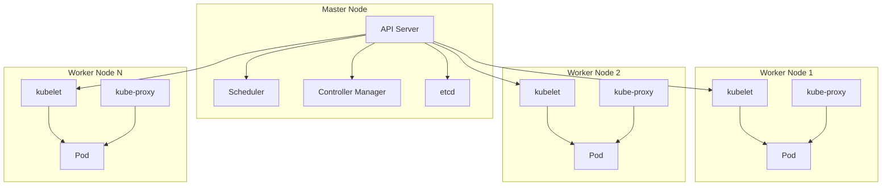

#Architecture Kubernetes

### Explications rapides :
- **Master Node** :
  - **API Server** : Interface centrale pour gérer Kubernetes.
  - **Scheduler** : Attribue des Pods aux nœuds.
  - **Controller Manager** : Supervise les boucles de contrôle.
  - **etcd** : Base de données distribuée pour stocker l'état du cluster.

- **Worker Nodes** :
  - **kubelet** : Assure que les conteneurs sont en cours d'exécution.
  - **kube-proxy** : Gère le réseau et le routage.
  - **Pods** : Unité de déploiement contenant un ou plusieurs conteneurs.

- La communication se fait via l'**API Server**, et **etcd** conserve l'état global du cluster.
